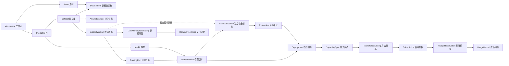

# SenseMu 产品对象与业务边界

- 更新日期：2026-09-17
- 状态：产品、前端、后端共同遵循的领域模型基线
- 面向读者：产品、设计、前端、后端、算法、测试与基础设施协作者

本文回答一个基础问题：SenseMu 中的“项目、数据集、标注、训练、模型、评测、服务和商品”分别是什么，它们之间如何衔接，以及哪些边界不能被页面便利或实现细节破坏。

字段级接口以 `apps/api/openapi.json` 为准，数据库实现以 `apps/api/src/sensemu_api/db/models.py` 为准。二者与本文冲突时，不应静默选择其中一方，而应先确认产品语义并同步修正代码、接口和文档。

## 1. 第一性原则

SenseMu 的核心不是堆叠 AI 功能，而是让一份视觉素材经过可验证的生产过程，最终成为可交付、可调用、可交易的视觉能力。

所有设计遵循五条原则：

1. 一个对象只表达一种事实。项目不是训练任务，模型不是在线服务，商品也不是模型。
2. 准备过程可以修改，正式输入和输出必须冻结。数据集可以持续整理，数据版本不能原地修改。
3. 执行与产物分离。训练任务记录一次执行，模型版本记录执行成功后登记的不可变产物。
4. 技术产物与商业承诺分离。部署解决“能运行”，能力契约解决“对外承诺什么”，商品解决“如何售卖”。
5. 页面只呈现真实事实。未接入、未验收、未发布或仅为演示的数据，不能通过文案或 Mock 状态伪装成已完成。

由此得到最短主链路：

```text
工作区 → 项目 → 数据集 → 标注与审核 → 冻结数据版本
→ 训练任务 → 模型版本 → 独立验收 → 在线服务
→ 能力契约 → 算法商品 → 授权 → 调用与计量
```

数据交易从冻结数据版本分叉：

```text
冻结数据版本 → 数据商品 → 交付规范 → 授权后交付
```

## 2. 对象分类

| 类型 | 对象 | 是否可修改 | 核心意义 |
|---|---|---|---|
| 权限与业务容器 | `Workspace`、`Project`、`Model` | 有限可修改 | 确定归属、目标和长期身份 |
| 数据准备工作区 | `Dataset`、`DatasetItem`、`AnnotationTask` | 完成或冻结前可修改 | 把原始素材整理成可训练数据 |
| 执行记录 | `Run`、`TrainingRun`、`AcceptanceRun` | 状态推进，规格不可随意改写 | 记录一次可失败、可重试的异步执行 |
| 不可变产物 | `DatasetVersion`、`ModelVersion`、`Evaluation`、`CapabilitySpec`、`DataDeliverySpec` | 不可原地修改 | 保证训练、验收、发布和交易可复现 |
| 运行时对象 | `Deployment`、`VisionEvent`、`UsageReservation`、`UsageRecord` | 按状态机变化 | 承担实际服务、事件和计量 |
| 商业对象 | `MarketplaceListing`、`MarketplaceSubscription`、订单、支付、退款、账本 | 按商业状态机变化 | 表达报价、授权、收款和收入事实 |

“不可变”不是数据库永远不能增加任何运维字段，而是对象所代表的业务内容不能被覆盖。需要改变内容时必须创建新版本，并保留旧版本的引用与历史。

## 3. 统一对象关系



重要关系：

- 一个工作区拥有多个项目和素材；所有租户对象都必须能追溯到工作区。
- 一个项目可以有多个数据集、训练任务、模型族和在线服务。
- 一个数据集可以冻结出多个数据版本；一个数据版本只描述冻结时的确定内容。
- 一次成功训练登记一个模型版本；一个模型族可以拥有多个模型版本。
- 独立验收使用没有参与该模型训练的冻结数据版本，不能把训练验证指标当作独立验收。
- 一个模型版本可以被多次验收或部署，但每个部署固定绑定一个明确的模型版本。
- 算法商品引用能力契约；数据商品引用冻结数据版本。商品不直接引用可变草稿或内部对象地址。

## 4. 权限与业务容器

### 4.1 Workspace / 工作区

工作区是租户、成员权限、数据所有权、供应方身份和商业账务的最高边界。同一用户可以加入多个工作区，但不能因登录成功就访问任意工作区资源。

后端处理每个工作区请求时必须同时验证：当前身份有效、当前成员关系有效、角色满足操作要求、目标对象确实属于该工作区。`X-Workspace-ID` 只负责选择上下文，不是授权凭据。

### 4.2 Project / 项目

项目是围绕一个长期视觉业务目标组织生产资产的容器，例如“工地 PPE 安全穿戴识别”。项目包含数据集、训练任务、模型、验收、在线服务和相关业务事件。

项目不是：

- 某一次训练；
- 某一份数据集；
- 某一个模型文件；
- 一个算法市场商品。

一个项目可以持续迭代多个数据版本和模型版本。暂停项目表示暂时不允许创建新的执行任务，归档表示退出日常生产视图；归档前必须处理运行中的任务、未完成标注和在线服务。

### 4.3 Model / 模型

模型是项目内稳定的模型族和血缘身份，按名称与任务类型聚合同一业务目标的多个版本。例如“PPE 安全穿戴模型”是模型，`v1`、`v2` 是模型版本。

模型本身不是权重文件，不能直接下载、验收或部署。所有这些动作都必须作用于明确的模型版本。

## 5. 数据与标注对象

### 5.1 Dataset / 数据集

数据集是项目内可持续整理的数据准备工作区。它定义任务类型与类别表，并聚合素材成员关系、数据划分和标注状态。

数据集在准备期可以增加素材、调整训练/验证/测试划分、完成标注和审核。已有标注任务、标注内容或冻结版本后，改变任务类型或类别定义会破坏既有语义，因此必须锁定；需要改变业务定义时新建数据集。

数据集不是可复现的训练输入。训练只能选择已经冻结的数据版本。

### 5.2 TaskType 与 ClassMap / 任务类型与类别表

任务类型规定标注结构和模型输出语义，例如目标检测、实例分割、图像分类或姿态估计。类别表规定该数据集中可以出现的业务类别及其连续编号。

类别编号是标注和模型输出协议的一部分，不是纯展示顺序。冻结后不得重排、复用或静默改名。具体支持范围和当前实现状态见 `docs/DATASET_TASK_TYPES.md`。

### 5.3 Asset / 素材

素材是工作区级的原始媒体对象，例如图片或视频文件，使用校验和、媒体类型、大小和尺寸等信息标识。素材的存储所有权与数据集成员关系分离，以便去重、复用和统一权限管理。

视频源文件只作为来源保存，不能直接进入当前图像训练链路；视频抽帧任务产生的图片素材才可进入数据集、标注与版本冻结。

### 5.4 DatasetItem / 数据集素材

数据集素材是数据集与素材之间的成员关系，保存该素材在当前数据集中的角色、数据划分和标注引用。同一素材可以在许可和业务规则允许时加入不同数据集，但其数据划分和标注属于各自的数据集上下文。

### 5.5 AnnotationTask / 标注任务

标注任务是对一批确定素材的操作分工与进度记录。任务创建时固定素材清单和类别表快照，避免数据集后续变化静默改变已分配工作。

标注任务不是数据集，也不是数据版本。任务完成只表示这批操作达到完成条件；通过数据检查并显式冻结后，才会产生数据版本。

### 5.6 DatasetVersion / 数据版本

数据版本是数据集经过完整性与质量检查后生成的不可变快照。它冻结以下内容：

- manifest 和素材身份；
- 任务类型与类别表；
- 训练、验证、测试划分；
- 标注引用与质量证据；
- 来源数据集与创建时间。

数据版本是训练、独立验收和数据市场上架共同使用的交付单位。历史版本不能原地编辑；修复数据后必须冻结新版本。

## 6. 训练、模型与评测对象

### 6.1 Run / 执行任务

`Run` 是通用异步执行记录，通过 `run_type` 区分训练、独立验收和批量推理。它保存输入版本、执行引擎、执行器、不可变 recipe、状态、进度、租约、尝试次数与时间线。

执行任务允许失败、取消、超时、恢复或重试。重试不能改写已经完成的历史，也不能让旧 Worker 覆盖新尝试。

### 6.2 TrainingRun / 训练任务

训练任务是目的为产生模型版本的 `Run`。用户必须选择明确的数据版本、训练引擎和配置。一次训练任务只代表一次执行尝试，不等同于模型。

训练成功时，后端应原子登记一个不可变模型版本；训练失败时保留失败原因和事件，但不生成可用模型版本。训练完成也不等于通过独立验收或具备生产发布资格。

### 6.3 ModelVersion / 模型版本

模型版本是一次成功训练产生的不可变模型产物。它必须能追溯到：

- 所属模型与项目；
- 唯一训练任务；
- 唯一训练数据版本；
- 任务类型与类别表；
- 训练框架、执行器和 recipe；
- 权重、报告、指标和产物身份。

模型版本是评测、导出、部署和对比的操作单位。内部 `artifact_uri` 不是浏览器下载地址；下载只能通过工作区授权接口，并校验登记的文件大小与 SHA-256。当前只交付原始模型产物，格式转换不属于首期合同。

### 6.4 EvaluationPolicy / 评测策略

评测策略是版本化的发布门禁，定义指标阈值、规则和适用任务类型。修改门禁应产生新策略版本，不能覆盖历史策略后让过去结论失去解释。

### 6.5 AcceptanceRun / 独立验收任务

独立验收任务是用独立冻结数据版本评估一个模型版本的 `Run`。验收数据不得参与该模型训练；否则只能算训练期评估，不能作为上线门禁证据。

### 6.6 Evaluation / 评测结论

评测结论是由“模型版本 + 评测策略版本 + 验收数据版本”共同确定的不可变结果，保存指标、逐条规则结果、通过或拒绝结论、报告与时间。

页面可以展示训练指标作为早期信号，但发布资格必须依据当前有效策略下的独立验收结论。

## 7. 发布、调用与事件对象

### 7.1 Deployment / 在线服务

在线服务是一个已批准模型版本在指定环境中的运行绑定，拥有稳定端点身份、启停状态、一次性密钥摘要和部署规格。

在线服务不是模型：模型版本描述“是什么产物”，在线服务描述“这个产物在哪里、以什么状态提供调用”。升级模型应显式创建或更新部署绑定并保留审计，不得让端点背后的版本无记录漂移。

### 7.2 CapabilitySpec / 能力契约

能力契约是从生产在线服务及其验收证据固化的不可变、面向业务的交付说明。它描述：

- 解决的问题与适用边界；
- 输入、输出和协议版本；
- 类别、阈值和限制；
- 性能与质量证据；
- 交付方式与版本身份。

部署解决技术运行问题，能力契约解决对外承诺问题。算法商品必须引用能力契约，不能直接引用一个会变化的在线地址。

### 7.3 VisionEvent / 视觉事件

视觉事件是模型推理结果经过确定业务规则后形成的业务事实，例如“未佩戴安全帽”。它应能追溯部署、模型版本、规则版本和命中依据，并支持去重与不含敏感原图的回放证据。

### 7.4 UsageReservation 与 UsageRecord / 额度预留与成功用量

推理开始前先预留额度，避免并发调用超额；只有推理成功后才确认用量，失败则释放预留。`UsageRecord` 是计费与供应方收入的成功事实，不能由前端估算，也不能在失败请求上生成。

## 8. 市场与商业对象

### 8.1 MarketplaceListing / 算法商品

算法商品是对一个已批准能力契约的商业报价，增加标题、分类、价格、额度、供应方和审核状态。它不是模型、模型版本或在线服务。

能力契约变化时应创建新版本并重新走必要审核；不能在商品仍公开时静默改变输入输出或质量承诺。

### 8.2 MarketplaceSubscription / 使用授权

使用授权表示买方工作区有权在有效期和额度内调用某个已发布商品。当前代码对象名为 `MarketplaceSubscription`，产品文案优先使用“授权”或“已购 API”，避免让一次性购买场景被“订阅”一词限制。

授权激活依赖已验证的订单与支付事实。客户密钥只在领取或轮换时展示一次，数据库只保存摘要。

### 8.3 Order、Payment、Refund 与 LedgerEntry / 订单、支付、退款与账本

订单表达买卖约定，支付事件表达渠道确认，退款表达资金逆向，账本分录表达供应方收入与平台相关财务事实。四者不能合并成一个模糊的“已购买”状态。

支付、退款和收入写入必须幂等、可审计。全额退款应按合同撤销或终止授权，不能只改变页面文案。

### 8.4 DataMarketplaceListing / 数据商品

数据商品是绑定一个冻结数据版本的公开数据卡，必须说明来源、采集方式、覆盖范围、已知限制、许可证、隐私处理和允许用途。

数据商品不能引用可变数据集草稿，也不能向公开页面暴露对象存储 URI、内部 manifest 或未经授权的原始文件。

### 8.5 DataDeliverySpec / 数据交付规范

数据交付规范是数据商品的不可变交付合同，说明授权后如何把确定版本的数据交付给买方工作区、包含哪些内容、使用什么格式和许可。商品文案变化不能改写已经成交订单所依据的交付规范。

当前产品已准备该对象边界，但真实购买、授权与交付尚未开放，页面必须明确显示这一事实。

## 9. 生命周期与状态规则

状态名以 OpenAPI 枚举为准，但所有实现必须保持以下语义：

| 对象 | 典型生命周期 | 必须阻止的捷径 |
|---|---|---|
| 项目 | 进行中 → 暂停 → 恢复或归档 | 有运行任务或在线服务时直接归档 |
| 数据集 | 草稿准备 → 标注与审核 → 冻结新版本 → 继续迭代 | 把可变草稿直接交给训练 |
| 标注任务 | 待处理 → 进行中 → 审核 → 完成或取消 | 素材未完整标注却标记完成 |
| 训练任务 | 排队 → 运行 → 成功、失败或取消 | 失败任务生成模型版本 |
| 模型版本 | 已登记 → 待验收 → 通过或拒绝 → 可部署 | 用训练指标代替独立验收 |
| 在线服务 | 已创建 → 启用 → 停用或替换 | 部署未通过当前门禁的模型版本 |
| 算法商品 | 草稿 → 待审核 → 已发布、拒绝或下架 | 未审核即公开发现或购买 |
| 使用授权 | 待支付 → 已激活 → 到期、耗尽或撤销 | 未验签支付就签发密钥 |
| 数据商品 | 草稿 → 已公开或下架 | 暴露内部存储地址或伪造已交付 |

状态推进由后端业务条件决定。前端按钮可以发起操作，但不能自行推断成功状态。

## 10. 页面与对象映射

| 产品页面 | 主对象 | 页面职责 |
|---|---|---|
| 工作台首页 | Project 与资源摘要 | 进入正在生产的项目和对象，不复制复杂创建表单 |
| 数据与标注 | Dataset、Asset、DatasetItem、AnnotationTask、DatasetVersion | 导入、划分、标注、审核、类别维护和版本冻结 |
| 训练 | TrainingRun、Model、ModelVersion、AcceptanceRun、Evaluation | 创建训练、观察执行、比较版本、验收和查看证据 |
| 发布与调用 | Deployment、批量推理 Run、VisionEvent | 启停服务、图像调用、批处理和事件查看 |
| 算法市场 | CapabilitySpec、MarketplaceListing | 发现和判断一项可购买的算法能力 |
| 数据市场 | DatasetVersion、DataMarketplaceListing、DataDeliverySpec | 判断数据来源、质量、许可和交付边界 |
| 我的 · 创作与销售 | 商品、订单、账本、跨项目任务与服务摘要 | 管理供应方商业事实并跳回生产对象 |
| 我的 · 购买与使用 | 授权、密钥、用量、订单与支付 | 管理已购能力和消费事实 |

一个动作原则上只有一个主入口：项目内完成生产，市场完成发现与购买，“我的”完成跨项目和商业汇总。汇总页只跳转，不复制生产流程。

## 11. UI、API 与数据库命名

| 业务概念 | 用户界面 | API/代码 | 数据库对象 | 说明 |
|---|---|---|---|---|
| 工作区 | 工作区 | `workspace` | `Workspace` | 租户与权限边界 |
| 项目 | 项目 | `project` | `Project` | 不使用“训练项目”作为另一种对象 |
| 数据集草稿 | 数据集 | `dataset` | `Dataset` | 可变准备空间 |
| 冻结数据 | 数据版本 | `dataset_version` | `DatasetVersion` | 可复现输入与数据交付单位 |
| 标注工作单 | 标注任务 | `annotation_task` | `AnnotationTask` | 固定素材范围的操作任务 |
| 一次训练 | 训练任务 | `training_run` | `Run(run_type=training)` | 执行记录，不称为模型 |
| 模型族 | 模型 | `model` | `Model` | 稳定血缘身份 |
| 模型产物 | 模型版本 | `model_version` | `ModelVersion` | 评测、导出和部署单位 |
| 独立验收 | 独立验收 | `acceptance_run` | `Run(run_type=acceptance)` | 与训练期评估区分 |
| 评测结论 | 评测结果 | `evaluation` | `Evaluation` | 不可变门禁证据 |
| 运行端点 | 在线服务 | `deployment` | `Deployment` | UI 避免直接暴露基础设施术语 |
| 可售算法 | 算法商品 | `marketplace_listing` | `MarketplaceListing` | 引用能力契约 |
| 买方权限 | 使用授权 / 已购 API | `subscription` | `MarketplaceSubscription` | 代码兼容 subscription 命名 |
| 可售数据 | 数据商品 | `data_listing` | `DataMarketplaceListing` | 引用冻结数据版本 |

API 路径和数据库类名可以保留稳定兼容性，但新 UI 文案必须使用上表术语。不能为同一对象再造“实验、任务、版本、服务”等含义重叠的别名。

## 12. 不可破坏的业务不变量

1. 所有租户对象都能追溯到工作区，服务端逐次验证成员关系和角色。
2. 数据集是可变工作区，数据版本是不可变快照；训练和数据商品只引用后者。
3. 标注任务固定素材和类别快照，数据集后续变化不能静默重解释历史任务。
4. 训练任务是执行记录，模型版本是成功产物；失败训练不产生模型版本。
5. 每个模型版本都能追溯唯一训练任务、数据版本、类别表、recipe 和产物身份。
6. 独立验收数据不参与该模型训练，发布资格不能只依赖训练指标。
7. 部署固定绑定明确模型版本，端点背后的版本变化必须可审计。
8. 算法商品只引用不可变能力契约，数据商品只引用不可变数据版本。
9. 推理前预留额度，成功后确认用量，失败后释放；供应方收入只来自成功用量或明确合同事实。
10. 密钥只展示一次并只存摘要；内部对象地址、令牌和凭据不得进入公开响应或日志。
11. 异步任务先持久化后派发，回写必须验证当前租约或尝试令牌。
12. 演示、未接入、未验收和不可用必须如实标注，不能生成 Mock 成功事实。

## 13. PPE 项目示例

下面用“工地 PPE 安全穿戴识别”说明同名词之间的区别：

| 对象 | 示例 |
|---|---|
| 工作区 | 某安全生产技术公司 |
| 项目 | 工地 PPE 安全穿戴识别 |
| 数据集 | PPE 现场图片主数据集 |
| 任务类型与类别 | 目标检测；安全帽、反光衣、人员 |
| 标注任务 | 第一批 800 张图片框选与复核 |
| 数据版本 | `ds_v3`，冻结 1,200 张图片及其划分、标注和质量报告 |
| 训练任务 | 使用 `ds_v3` 和指定 YOLO 引擎执行的一次训练 |
| 模型 | PPE 安全穿戴模型 |
| 模型版本 | `v2`，由该训练任务登记的权重与报告 |
| 独立验收 | 用未参与训练的“PPE 夜间验收集 v1”评测 `v2` |
| 评测结论 | 当前门禁全部通过，附指标和规则明细 |
| 在线服务 | 生产环境 `ppe-safety` 图像推理端点，绑定 `v2` |
| 能力契约 | 接受 JPEG/PNG，返回 `detections.v1`，声明类别、限制和验收证据 |
| 算法商品 | “PPE 安全穿戴识别 API”，引用上述能力契约并等待平台审核 |
| 使用授权 | 买方工作区在有效期与额度内调用该商品的权利 |
| 成功用量 | 某次请求成功返回后确认的一条可计量记录 |

## 14. 相关文档

- 产品页面和功能边界：`docs/PRODUCT_FUNCTIONS.md`
- 用户角色与完整旅程：`docs/USER_JOURNEYS.md`
- 数据任务类型和类别：`docs/DATASET_TASK_TYPES.md`
- 后端协同入口：`docs/DEVELOPER_HANDOFF.md`
- 接口、鉴权和调用时序：`docs/API_GUIDE.md`
- 当前状态与优先级：`docs/PROJECT_STATUS.md`
- 页面收敛基线：`docs/PRODUCT_SURFACE_BASELINE.md`
- 数据库模型：`apps/api/src/sensemu_api/db/models.py`
- 字段级接口事实：`apps/api/openapi.json`
